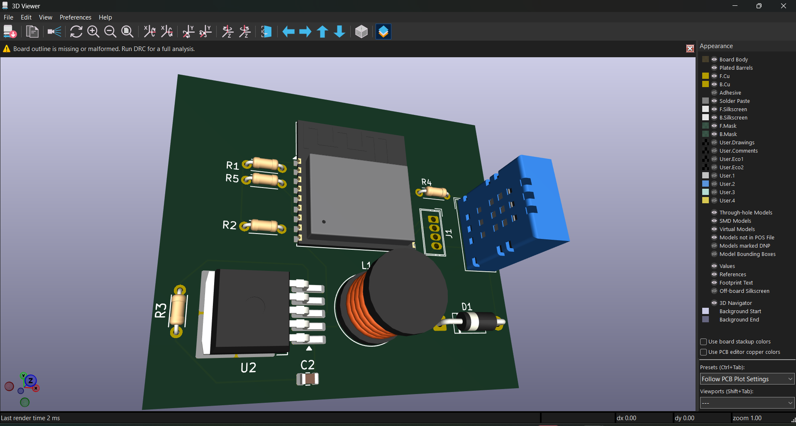
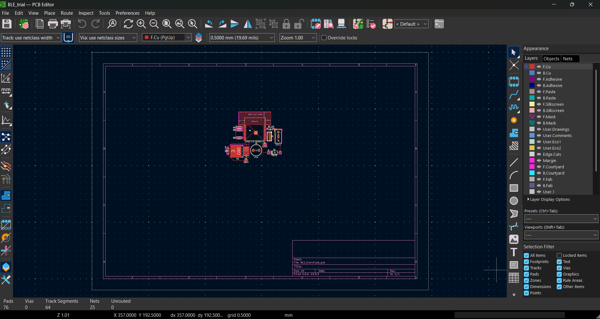

# ble-pcb-kicad
BLE module PCB designed in KiCad - schematic, layout and BOM
# BLE PCB — KiCad

A custom BLE module PCB designed from scratch in KiCad 10.

## Overview
Designed a custom 2-layer IoT sensor PCB in KiCad 10 using the ESP32-C3-WROOM-02, featuring onboard power regulation, RF-compliant layout, and reliable boot/reset circuitry.

Validated the design through ERC, DRC, and 3D mechanical checks, producing fabrication-ready Gerber files for low-power wireless sensing applications.

## Schematic

## PCB 3D View

## PCB routing

  

## Tools
- KiCad 10
- [ESP32-C3-WROOM-02 — Main microcontroller and wireless communication module

LM2985S-3.3  — Power regulation from 9V to 3.3V

SB120 Schottky Diode — Reverse-current protection and improved efficiency]

## Author
Achyutha U | EEE, BNMIT 2027
