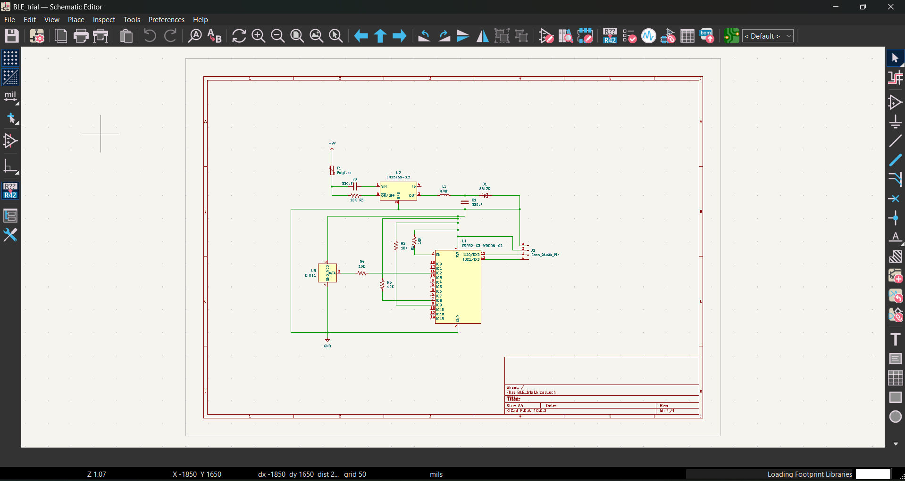

# ble-pcb-kicad
BLE module PCB designed in KiCad - schematic, layout and BOM
# BLE PCB — KiCad

A custom BLE module PCB designed from scratch in KiCad 10.

## Overview
[Power section: LN2985S-3.3 buck regulator converting a 9V input to a stable 3.3V rail. Sized the inductor (47µH) and output capacitor (330µF) to meet ripple requirements, and placed an SB120 Schottky diode for reverse-current protection and efficiency.]

## Schematic

## PCB 3D View

## Tools
- KiCad 10
- [IC names you used]

## Author
Achyutha U | EEE, BNMIT 2027
